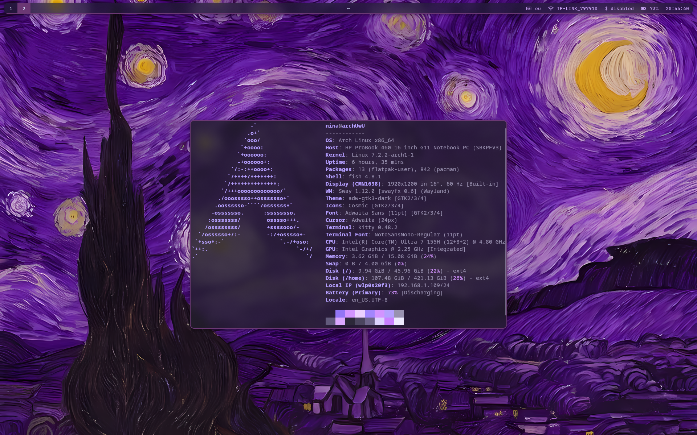

# MorSway

Minimal, lightweight, functional and PURPLE sway & swayfx dotfiles

Huge thanks to dear [Parviz](https://github.com/parvizsudo/Aozora), for this README template and a lotta useful info



## ⚙️ Requirements

- Any distro with sway or swayfx
- Basic understanding of terminal and shell-script knowledge

## 📦 Packages Used

| Category             | Packages                               |
| -------------------- | -------------------------------------- |
| **Core**             | `swayfx`                               |
| **Bar / Launcher**   | `waybar`, `rofi`                       |
| **Notifications**    | `dunst`                                |
| **Wallpaper**        | `swaybg`                               |
| **Authentication**   | `not yet implemented`                  |
| **Logout**           | `wlogout`                              |
| **Screenshots**      | `grim`                                 |
| **Clipboard**        | `cliphist`, `wl-copy` (`wl-clipboard`) |
| **QT / GTK Theming** | `nwg-look`                             |
| **Idle / Lock**      | `swayidle`, `swaylock`                 |
| **Network**          | `network-manager`, `nmtui`             |
| **Bluetooth**        | `blueman`                              |
| **OSD**              | `dunst`                                |
| **FileManager**      | `cosmic-files`                         |


## 📂 Configuration Structure

All configs live in `~/.config/`:

## 🚀 Installation

### 1. Install the required packages

**Arch / Arch-Based Distros:**

```bash
curl -fsSL https://raw.githubusercontent.com/birmorezik/morsway/main/install.sh | bash
```

**Debian / Debian-Based Distros:**
- Please refer to [SwayFX INSTALL_deb.md](https://github.com/wlrfx/swayfx/blob/master/INSTALL-deb.md) for installing SwayFX and then run the installer.
- If you wish to use sway instead of SwayFX, make sure to remove the "SwayFX" section from ~/.config/sway/config

**Other Distros:**.
- Install Sway / SwayFX and the necessary apps, then download the conf folders and put them in your ~/.config
- If you wish to use sway instead of SwayFX, make sure to remove the "SwayFX" section from ~/.config/sway/config

## First launch

- Log out of your current session.
- From your display manager (or TTY) select **sway**.
- If no DM, start with `sway` from the TTY.


## 🎨 Theming Details

- **Wallpaper:** `swaybg` is used to set wallpaper (set via modifying `output * bg /home/$USER/Pictures/wall/wall.png fill` to point to your wallpaper of choice).

## ⌨️ Keybindings

| Action              | Shortcut                                    |
| ------------------- | ------------------------------------------- |
| **Terminal**        | `SUPER` + `Return`                          |
| **App launcher**    | `SUPER` + `D`                               |
| **Close window**    | `SUPER` + `Q`                               |
| **Toggle float**    | `SUPER` + `SHIFT` + `Space`                 |
| **Screenshot**      | `PrtSc` (Fullscreen)                        |
| **Lock screen**     | `SUPER` + `SHIFT` + `Esc`                   |
| **Logout menu**     | `SUPER` + `Esc`                             |
| **File manager**    | `SUPER` + `E`                               |
| **Firefox**         | `SUPER` + `Z`                               |

> 🔧 **Note:** Volume & brightness OSD is provided by `swayosd` – shows overlay on change.

## 🖼️ Usage Guide

### Clipboard history (cliphist)

- View history: `SUPER + V`

### Lock & Idle

- **Manual lock:** `SUPER + SHIFT + Esc` triggers `swaylock`.
- **Automatic lock:** adjust in `~/.config/sway/config`.

### Logout menu (wlogout)

- Press `SUPER + Esc` to show a grid with **logout**, **reboot**, **shutdown**, **suspend**, **lock** and **Hibernate**.

### Network (nm-applet)

- Click on the Wifi icon on waybar to open nmtui in a separate kitty window. 

### Volume / Brightness OSD

- Use the `FN` key combos (adjust in ~/.config/sway/config).
- If OSD doesn’t appear, ensure you have pipewire, wireplumber, brightnessctl and dunst installed.

## 🛠️ Troubleshooting

| Problem                                       | Likely fix                                                                                                                           |
| --------------------------------------------- | ------------------------------------------------------------------------------------------------------------------------------------ |
| **Clipboard history not saving**              | Run `cliphist` manually: `wl-paste --watch cliphist store` and look for errors                                                       |
| **Waybar shows no icons**                     | Install a nerd‑fonts patched font (e.g., `ttf-nerd-fonts-symbols`) and set it in `waybar/style.css`.                                 |
| **swayidle doesn’t lock**                     | Check that `swaylock` is installed. Test with `swaylock` manually.                                                                   |

# 📝 Customization Tips

- **Change keybindings** – Edit `~/.config/sway/config`.
- **Add your own wallpaper** – Place your wallpaper in any directory and point to it in `~/.config/sway/config`.
- **Edit the logout menu** – Modify the layout in `~/.config/wlogout/` (`.css` and `layout` files).

---

For further help, check the [Sway website](https://swaywm.org) or the individual tool documentation.

- **Some** files were generated with the help of AI ( Mostly some parts of waybar css ).

**If you like my configs, don't forget to leave a star ⭐**
